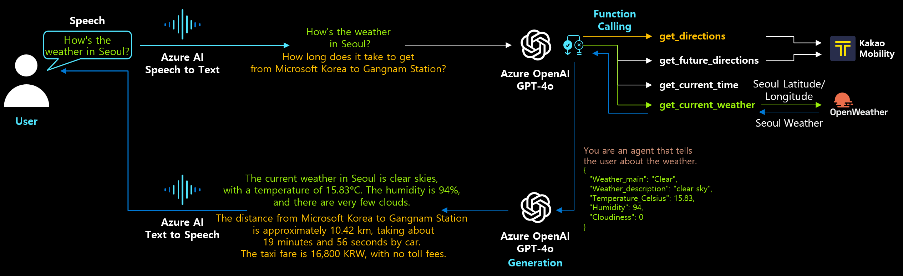

# GPT Basics, Use Cases, and Sample Solutions
This repository includes resources to help you understand the basics of using GPT (Generative Pre-trained Transformer) provided by Azure OpenAI, along with sample solutions and various use cases.

AI Tour ["Mastering RAG in Practice" PDF File](http://azure.studydev.com/event/workshop_rag.pdf) is shared for your reference.

## Getting Started
Quickly set up your development environment using the Codespace environment.  
**Click the button below** to open the repository in GitHub Codespaces and get started!  

For Python runtime, we recommend `python=3.11.4`. After clicking the button, it takes approximately 7 minutes to complete the installation of the development environment and libraries defined in the `.devcontainer`. Visual Studio Code IDE will then appear in your browser.

### GPT Version Used in Exercises
The samples here are primarily based on GPT-4o. They have been tested on the latest version of GPT-4o. We recommend using either the gpt-4o-mini model or the latest gpt-4o model. (As of December 19, 2024)

### Setup
> To ensure secure local key management, it is strongly recommended to use the ***.env*** file for storing API endpoints or API keys required for the exercises. For example, copy the [.env.sample](./.env.sample) file to create a `.env` file and input the API key information.

### Development Environment Information
>**Python version: 3.11.4, Azure OpenAI version: 1.13.3 - As of March 17, 2024**  
This content is configured for a development environment based on DevContainer. If you use GitHub Codespaces or download this repository to Visual Studio Code IDE on a local system with Docker installed, the container will automatically set up the development environment (Python Runtime 3.11.4, Azure OpenAI 1.13.3). After entering the required API information in the .env file and saving it, you can proceed with the exercises.

----  

`Build Your Own Jarvis Assistant` has been added. Easily call external APIs with voice commands. [Go to Exercise](./quick_start/11_my_jarvis_stt_chatgpt_tts.ipynb)  

## What is GPT?
GPT (Generative Pre-trained Transformer) is a Large Language Model (LLM) developed by OpenAI. It is a deep learning model based on the transformer architecture. For more details, refer to [OpenAI](https://openai.com).  
For a quick overview, check the following documents:
- [Introduction to Azure OpenAI - deck](http://azure.studydev.com/openai/aoai_2023_201.pdf)
- [Latest Updates on Azure OpenAI Service - deck](http://azure.studydev.com/openai/aoai_2024_q1.pdf)

## Resources
Learn GPT step by step in the following order:

- [(For Everyone) Basics of Prompt Engineering](http://azure.studydev.com/openai/aoai_2024_pe_01.pdf)

- [(For Everyone) Playing with Prompt Engineering in Playground](http://azure.studydev.com/openai/aoai_2024_pe_02.pdf)

- [(For Developers) Prompt Engineering in IDE](http://azure.studydev.com/openai/aoai_2024_pe_03.pdf)

- [(For Developers) Prompt Engineering - Quick Start](./quick_start/): A collection of notebooks for getting started quickly with GPT.

## Reference Videos for Practice
This workshop provides free educational videos for self-paced learning. These videos will be organized as a series and released in September 2024.
- [Basic Prompt Engineering Explained Through Code](https://youtu.be/XQ917ZOaaOk)  
> This video introduces how to perform prompt engineering using Python code. It includes source code (GitHub repository) and DevContainer setup information to run in an environment with Python Runtime 3.11.4 and Azure OpenAI 1.13.3. For a quick development environment setup, use GitHub's Codespace to develop and test directly in a browser-based Visual Studio Code IDE.

- [Building RAG Architecture with Wikipedia Data on Azure](https://youtu.be/MOOHK1b4Syk)  
> Without requiring programming knowledge, this video explains how to create a service that queries your data and generates answers. It covers how to embed Wikipedia documents into a vector database, index them with Azure AI Search, and use Azure OpenAI Studio's "on your data" feature to instantly create a chatbot service.

- [LLMOps Prompt Flow Video](https://youtu.be/ECl0D8rHoDc)  
> This video introduces Prompt Flow, a tool for LLMOps, and demonstrates creating and testing a RAG-based API that queries a vector database to provide answers. To practice with Codespace, you can use the legacy repository at https://github.com/HyounsooKim/promptflow-kr.

- [Creating RAG Apps Using Prompt Flow in Azure AI Studio](https://youtu.be/92_oxGaMXSY)  
> Learn how to use Prompt Flow in Azure AI Studio to create a RAG-based API that queries indexed vector databases and generates desired answers.

## Choosing a Development Environment
> To ensure seamless practice, this repository provides a `.devcontainer` environment. If you do not wish to install Docker or IDE on your PC, `Codespace` is recommended.
- If `Docker` is installed on your local PC, you can run "Reopen DevContainer" in VS Code to automatically install the runtime and packages required for practice.
- By using GitHub's `Codespace`, the container is set up on a remote VM provided by Codespace, and development can begin immediately using the browser-based VS Code.

Note: `Codespace` offers free 15GB storage and 120 hours/core VM for individual GitHub accounts. [Click for detailed pricing information](https://docs.github.com/en/billing/managing-billing-for-github-codespaces/about-billing-for-github-codespaces).

## Program Origin
This repository is based on https://github.com/Azure/azure-openai-samples.  
This code is the English-translated version of the code used at [Korea version](https://github.com/HyounsooKim/azure-openai-samples-kr).  

It originated in July 2023 during the [Woowahan Hackathon 2023](https://techblog.woowahan.com/13929/) hosted by Woowahan Brothers, which marked the beginning of content creation from May 2023. From July 2023 to April 2024, the program engaged over 1,000 participants. The repository was forked separately to better cater to the Korean audience, as independent updates tailored to the local environment were deemed more beneficial than integration with the original repo. **This program is free**, and the second morning of the two-day Prompt Engineering Workshop is for training. The afternoon session transitions into [Prompt Flow Quick Start](https://microsoft.github.io/promptflow/how-to-guides/quick-start.html), teaching LLMOps-based app development. Afterward, a 2–3-day hackathon aims to rapidly prototype Gen AI-based MVP models. Find event details in the [Program Introduction Document](http://azure.studydev.com/openai/aoai_2024_pe_00.pdf).  

## Customer Cases
Below are publicly disclosed companies where the `Gen AI Workshop & Hackathon` was conducted:  
- July 2023: **Woowahan Brothers** - [Woowahan Hackathon 2023](https://zdnet.co.kr/view/?no=20230717092217)  
- January 2024: **Finda** - [Finda's Internal Hackathon '2024 FindaThon'](https://www.etnews.com/20240205000064)  
- July 2024: **Interpark Triple** - [Interpark Triple's Internal Hackathon 'Intthon 2024'](https://zdnet.co.kr/view/?no=20240705140508)
- Dec 2024: **Market Kurly** - [Market Kurly's Internal Hackathon 'Kurly Hackathon 2024'](https://www.starnewskorea.com/stview.php?no=2024122413513146230)

## Contributing
We welcome contributions to this repository. If you have any ideas or suggestions, please feel free to open an issue or submit a pull request.

As technologies change very quickly, we strive to keep this repository as up-to-date as possible. However, this heavily relies on the active participation of the community to make it happen.
